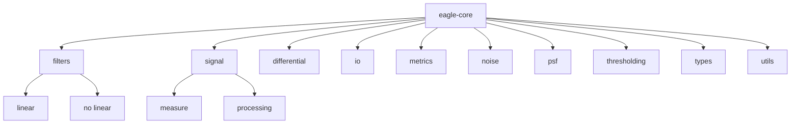

# Welcome to eagle-core

---

Note that README.md file is in /docs folder

---

## Presentation

eagle-core is a python package for signal processing.

---

## Package structure



---

## Installation

### Nix package manager

The [default.nix]() file defines the configuration to build this package
with nix.


By title of example, in your own `shell.nix` file, you can do :
```nix
{ pkgs ? import <nixpkgs> {}, ... }:

let 

  eagle-core = pkgs.fetchFromGitHub {
    owner = "akhaten";
    repo = "eagle-core";
    rev = "the/full/id/of/commit";
    sha256 = "sha256-0000000000000000000000000000000000000000000=";
    #sha256 = lib.fakeSha256;
  };
        
in pkgs.mkShell {

    buildInputs = with pkgs; [
      callPackage eagle-core {} # Use default.nix in the repo
      # Yours others packages
      # ...
    ];
}
```

### Pip

```sh
python3 -m venv venv
souce ./venv/bin/activate # To disable virtual environment => ./deactivate
pip3 install git+https://www.github.com/akhaten/eagle-core.git
```

---


<!-- The homomorphism $f$ is injective if and only if its kernel is only the 
singleton set $e_G$, because otherwise $\exists a,b\in G$ with $a\neq b$ such 
that $f(a)=f(b)$. -->

<!-- ``` mermaid
classDiagram
  Person <|-- Student
  Person <|-- Professor
  Person : +String name
  Person : +String phoneNumber
  Person : +String emailAddress
  Person: +purchaseParkingPass()
  Address "1" <-- "0..1" Person:lives at
  class Student{
    +int studentNumber
    +int averageMark
    +isEligibleToEnrol()
    +getSeminarsTaken()
  }
  class Professor{
    +int salary
  }
  class Address{
    +String street
    +String city
    +String state
    +int postalCode
    +String country
    -validate()
    +outputAsLabel()  
  }
```

```mermaid
gitGraph LR:
    commit
    commit
    branch develop
    commit
    commit
    checkout main
    commit
    commit
    merge develop
    commit
    commit
``` -->

<!-- ```mermaid
%%{ init: { "flowchart" : { "useMaxWidth": 10 } } }%%
mindmap
  root((mindmap))
    Origins
      Long history
      ::icon(fa fa-book)
      Popularisation
        British popular psychology author Tony Buzan
    Research
      On effectiveness<br/>and features
      On Automatic creation
        Uses
            Creative techniques
            Strategic planning
            Argument mapping
    Tools
      Pen and paper
      Mermaid
``` -->
